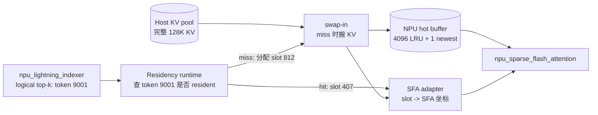
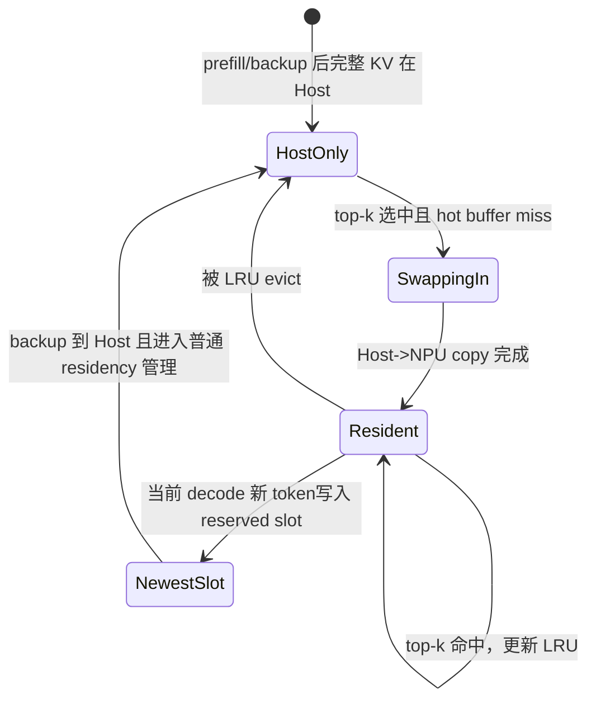

## NPU HiSparse 技术路径说明

### 1. 问题和心智模型

当前 GLM-5 在 NPU 上已经会 sparse attention：`npu_lightning_indexer` 每步选 top-k token，例如 2048 个；`torch_npu.npu_sparse_flash_attention(...)` 只对这些 token 算 attention。它省计算，不省 KV 显存：KV cache 仍按 PA_BSND 全量常驻 NPU。

HiSparse 改的是 KV 存放位置：完整 KV 放 Host，NPU 每层只留一个小 hot buffer。比如 128K 上下文里，每步 attention 只读 2048 个 token，就希望 NPU 只放 4096 个 LRU slot + 1 个 newest slot，而不是放完整 128K。

GPU 能直接做，是因为 FlashMLA sparse decode 的 `indices` 已经是 **device KV cache 坐标**。NPU SFA 当前的 `sparse_indices` 不是物理地址，还要经 `layout_kv` 和 `block_table` 解释。因此 NPU HiSparse 的本质是：**在 SFA 前做地址空间翻译：logical token -> hot slot -> SFA 坐标**。由于 GLM-5 当前生产调用已经是 `layout_query="TND"` + `layout_kv="PA_BSND"`，最小改造主线应先保留 PA_BSND，通过重映射 `block_table` 让 SFA 读 hot buffer；BSND hot-slot 直读是更像 GPU 的优化路线，但需要改调用形态。

| 项 | 当前 NPU GLM-5 | NPU HiSparse 后 |
|---|---|---|
| KV 在哪 | 全量 KV 在 NPU PA_BSND cache | 全量 KV 在 Host，NPU 只有 hot buffer |
| top-k 是什么 | logical token，例如 token 9001 | 仍然是 logical token |
| SFA 读哪 | `topk_indices + block_table` 指向全量 NPU cache | 改写后的坐标指向 NPU hot buffer |
| 新增工作 | 无 residency | hit/miss、搬 miss、把 logical token 改写成 hot slot/SFA 坐标 |

只记两个对象：indexer 输出 **logical token**，例如 `9001`；SFA 最终要读 **hot buffer slot**，例如 `407` 或 `812`。

### 2. token 9001 怎么走

假设 batch=2、decode、topk=2048，request 0 的第 k 个 top-k 是 logical token `9001`。

| 路径 | token 9001 后续怎么变成 KV 地址 | 关键差异 |
|---|---|---|
| GPU FlashMLA + HiSparse | `swap_in_selected_pages(...)` 查 hot buffer；miss 时从 Host 搬到 GPU device buffer；返回 `top_k_device_locs[0,k]=x`；SGLang 传 `indices=page_table_1.unsqueeze(1)`；FlashMLA kernel 对 `x` 做除法/取模，读 `k_cache` | `x` 已经是 device KV cache 坐标，FlashMLA 不需要理解 Host、LRU、miss |
| 当前 NPU SFA | `npu_lightning_indexer` 输出 `topk_indices[0,k]=9001`；SFA 先算 `s2Idx=sparse_indices+s2StartIdx`；当前 `layout_kv="PA_BSND"`，再用 `s2Idx/blockSize` 查 `block_table`；最后读全量 NPU KV cache | `9001` 是 S2 token 位置，不是物理地址，也不是 hot slot |
| NPU HiSparse 后 | runtime 先查 token `9001` 是否在 hot buffer；hit 则读 slot 407；miss 则从 Host 搬到 evict slot 812，再读 slot 812 | 多了 `logical token -> hot slot -> SFA 坐标` 两段 |

最大差异：

| | GPU FlashMLA | NPU SFA |
|---|---|---|
| attention 输入 index 的语义 | 已经是 device KV 坐标 | 仍是 SFA S2 空间坐标 |
| HiSparse 是否适配 attention ABI | 很少，直接给 `indices` | 必须把 hot slot 编成 SFA 能读的坐标 |
| 是否依赖 page table | sparse FlashMLA 不依赖 | PA_BSND 依赖；BSND 不依赖 |

### 3. NPU 适配拆成两段

| 转换 | 输入 | 输出 | 消费方 |
|---|---|---|---|
| Residency | logical top-k，例如 `[9001, 17, ...]` | hot slot，例如 `[407, 12, ...]` | SFA adapter |
| SFA adapter | hot slot，例如 `407` | 优先生成 PA_BSND 的 remapped S2 / `block_table`；也可生成 BSND 的 S 轴 index | `npu_sparse_flash_attention` |

Residency 回答“token 在不在 NPU 上、miss 放哪格”；SFA adapter 回答“怎样让现有 SFA 读到这格”。Residency 所有方案都要做；SFA adapter 有三种路线，其中当前 GLM-5 应先验证 PA_BSND remap。

### 4. SFA 怎么读 hot buffer

| 路线 | SFA 看到的 KV | 坐标怎么填 | 优点 | 风险/约束 | 结论 |
|---|---|---|---|---|---|
| A：PA_BSND `block_table` 重映射 | 保持当前 `layout_query="TND"`、`layout_kv="PA_BSND"`、`block_table` | 让 `block_table` 指向 hot buffer block，而不是全量 NPU cache block；`sparse_indices` 可保留原始 logical token，或重写到 compact hot S2 | 最贴近 GLM-5 当前生产 ABI；query/rope/output 形态改动最少 | PA_BSND 用 `s2Idx/blockSize` 查表；block_size=128 时，一个 miss token 可能要求搬整个 128-token block；page 放大会吃 hot buffer 和 H2D 带宽 | 当前主线，先做 golden 并量化 page 放大 |
| B：BSND hot-slot 直读 | `key/value=[B,4097,1,512]`，`key_rope=[B,4097,1,64]`，`block_table=None`，`layout_kv="BSND"`，`layout_query="BSND"` | token `9001` 在 request 0 slot 407，则 `sparse_indices=407`；BSND 分支用 `boIdx*s2Size+s2Idx` 直接读 slot | 最像 GPU；token-wise；无 page 放大 | 当前生产不是 BSND；query/rope/output reshape 都要切；SFA 会做 `sparse_indices+s2StartIdx`；本地 BSND CI 只覆盖 K=16/32，GLM-5 K=2048 + MLA rope + graph tuple 需 golden | 优化/备选路线，不作为最小改造主线 |
| C：改 SFA | 新 hot-slot ABI | `sparse_indices` 直接表示 hot slot，或支持 FlashMLA-style encoded KV index | 语义最干净 | 要改 `ops-transformer/attention/sparse_flash_attention` 的 op host、tiling、kernel、测试和分发 | A/B 都对不齐 baseline 时兜底 |

PA_BSND 重映射有两个变体：

| 变体 | 做法 | 代价 |
|---|---|---|
| 保留原始 logical S2 | `sparse_indices` 继续填 9001，`block_table` 覆盖原始 128K 序列的 block 空间 | table 语义简单，但 hot buffer 承受 page 放大 |
| compact hot S2 | top-k token 重写到小 hot S2 空间，`block_table` 只覆盖 hot blocks | 每步维护 logical token 到 compact token/page 的映射 |

### 5. miss KV 怎么搬

SFA 路线解决“读哪里”；搬运路线解决“miss 的 KV 怎么从 Host 到 NPU hot buffer”。

| 搬运路线 | 流程 | 优点 | 风险/代价 |
|---|---|---|---|
| kernel 自搬 | 一个 AscendC residency kernel 读 `topk_indices`，查 resident table；hit 直接输出 slot；miss 选 evict slot，例如 812；kernel 内从 Host KV pool 把 token `9001` 搬到 slot 812；输出 slot 给 SFA adapter | 对标 GPU，一次 launch 内完成 hit/miss、LRU、miss copy、hot slot 输出 | 必须实测 AscendC kernel 能否高效读 Host memory：Host 注册方式、kernel 内 `DataCopy`、带宽、CANN Graph |
| Host staged DMA | judge kernel 只输出 miss list、evict slot、hit slot；Host 读 miss list；Host 发 H2D copy；finalize 补齐最终 `sparse_indices`；再调 SFA | 更稳，不依赖 kernel 直读 Host | 每步多一次 device-host-device 控制链，Graph 更容易被切开 |

GPU 已经走 kernel 自搬：CUDA kernel 在 miss 时写 `req_top_k_device_locs`，并从 `host_cache_k` 拷到 `device_buffer_k`。

现有 `transfer_kv_dim_exchange` 只能作为 staged DMA 参考，不是完整答案。它是 Host API，要求 5D tensor，按 page 做 CPU 循环并发 `aclrtMemcpy2dAsync`；适合 PA/page hot buffer。如果走 BSND token slot，需要新的 token-wise staged copy。

### 6. 端到端例子

设 batch=2，每个 request 的 hot buffer 为 4096 个 LRU slot + 1 个 newest slot，每步 topk=2048。request 0 有 1700 hit / 348 miss，request 1 有 1800 hit / 248 miss，总 miss=596。

| 路径 | 端到端过程 |
|---|---|
| PA_BSND remap + Host staged DMA | indexer 输出 `[2,2048]` logical tokens；judge kernel 输出 miss list 和 evict block；Host staged DMA 搬 miss 对应 hot pages；adapter 更新 `block_table`，让 `sparse_indices=9001` 映射到 hot page；SFA 继续走 PA_BSND 分支 |
| BSND hot-slot + kernel 自搬 | `npu_lightning_indexer` 输出 `[2,2048]` logical tokens；residency kernel 查两个 request 的 4096 个 hot slots；3500 个 hit 直接写 hot slot，例如 `9001 -> 407`；596 个 miss 分配 evict slot 并从 Host 搬 KV；kernel 输出 `[2,2048]` hot slots；SFA adapter 组织 BSND `sparse_indices`；SFA 用 `[B,4097,1,D]` hot buffer 算 attention |

PA_BSND 路径更贴近现有 GLM-5 调用形态，但若 `block_size=128`，596 个 miss token 可能对应很多 128-token page，实际收益要靠 page 放大统计决定。BSND 路径里，SFA 不知道 Host 和 LRU，只看到一个小 KV cache 和一张 slot 清单，但要先改掉当前 TND+PA_BSND 调用形态。

### 7. 状态模型

每个 `(request, layer, logical token)` 的状态：

attention 只应该读 `Resident` 或 `NewestSlot`。`HostOnly` token 被 top-k 选中时，必须先 swap-in，不能让 SFA 直接去原始 logical 位置读。

### 8. 开发清单和顺序

| 模块 | 谁调用它 | 输入 | 输出 |
|---|---|---|---|
| Host KV pool | prefill/backup/runtime | 完整 KV | Host 上按 request/layer/token 可寻址的 KV |
| NPU hot buffer | swap-in/SFA | 固定容量 slot，例如 4096+1 | SFA 可读的小 KV cache |
| Residency table | residency kernel/runtime | logical token | token 是否 resident、在哪个 slot |
| LRU/evict | residency kernel/runtime | hit/miss 访问 | evict slot |
| Swap-in backend | residency runtime | miss token、evict slot | KV 被搬到 hot slot |
| SFA adapter | attention backend | hot slot list | SFA 的 `sparse_indices` / `block_table` |
| Golden tests | 开发和回归 | full-resident 输出、HiSparse 输出 | 数值差异和性能拆分 |

| 顺序 | 做什么 | 要回答的问题 |
|---|---|---|
| P0 | 跑通 `sgl-kernel-npu` 最小自定义算子 | 能不能新增 NPU runtime/kernel |
| P1 | 做 PA_BSND remap golden | 保持 GLM-5 当前 ABI 时能否读 hot buffer，page 放大是否可接受 |
| P2 | 做 BSND hot-slot golden | 改成 BSND 后，SFA 不改源码能不能直接读 slot |
| P3 | 做 Host 直读探针 | 能不能 kernel 自搬 |
| P4 | 写 Python residency reference | 先把 hit/miss/LRU 行为跑对 |
| P5 | 写 residency judge kernel | device 上产出 miss list 和 hot slots |
| P6 | 接入 swap-in + SFA adapter | 单层对齐 full-resident baseline |
| P7 | 多层 decode 集成 | 61 层、batch>1、长上下文稳定对齐 |

### 9. 源码锚点

| 结论 | 源码 |
|---|---|
| GPU HiSparse 把 top-k 交给 `swap_in_selected_pages(...)` | [`nsa_backend.py`](../sglang-v0.5.12/python/sglang/srt/layers/attention/nsa_backend.py#L1612) |
| GPU 最终传 `flash_mla_with_kvcache(indices=page_table_1.unsqueeze(1))` | [`nsa_backend.py`](../sglang-v0.5.12/python/sglang/srt/layers/attention/nsa_backend.py#L1817) |
| FlashMLA `indices` shape 是 `[batch_size, seq_len_q, topk]` | [`flash_mla_interface.py`](../FlashMLA/flash_mla/flash_mla_interface.py#L85) |
| FlashMLA kernel 把 index 拆成 `block_idx` 和 `idx_in_block` | [`kernel.cuh`](../FlashMLA/csrc/sm100/decode/head64/kernel.cuh#L697) |
| GPU HiSparse miss 分支写 `req_top_k_device_locs`，并做 Host->Device copy | [`hisparse.cuh`](../sglang-v0.5.12/python/sglang/jit_kernel/csrc/hisparse.cuh#L347), [`#L371`](../sglang-v0.5.12/python/sglang/jit_kernel/csrc/hisparse.cuh#L371) |
| NPU GLM-5 当前 SFA 调用是 `layout_query="TND"`、`layout_kv="PA_BSND"` | [`ascend_backend.py`](../sglang-v0.5.12/python/sglang/srt/hardware_backend/npu/attention/ascend_backend.py#L949) |
| NPU 当前 `block_table` 来自 `req_to_token[:, ::page_size] // page_size` | [`ascend_backend.py`](../sglang-v0.5.12/python/sglang/srt/hardware_backend/npu/attention/ascend_backend.py#L359) |
| SFA 先做 `sparse_indices + s2StartIdx` | [`sparse_flash_attention_service_vector_mla.h`](../ops-transformer/attention/sparse_flash_attention/op_kernel/arch35/sparse_flash_attention_service_vector_mla.h#L203) |
| SFA PA_BSND 用 `blockTableGm[...] * blockSize + offset` | [`sparse_flash_attention_service_vector_mla.h`](../ops-transformer/attention/sparse_flash_attention/op_kernel/arch35/sparse_flash_attention_service_vector_mla.h#L225) |
| SFA BSND 直接用 `boIdx * s2Size + s2Idx` | [`sparse_flash_attention_service_vector_mla.h`](../ops-transformer/attention/sparse_flash_attention/op_kernel/arch35/sparse_flash_attention_service_vector_mla.h#L231) |
| 非 PA_BSND 要求 `layout_kv == layout_query`，且 `block_table` 为空 | [`sparse_flash_attention_tiling.cpp`](../ops-transformer/attention/sparse_flash_attention/op_host/sparse_flash_attention_tiling.cpp#L975), [`#L1829`](../ops-transformer/attention/sparse_flash_attention/op_host/sparse_flash_attention_tiling.cpp#L1829) |
| 本地 CI 的 BSND 用例 K=16/32，K=2048 用例走 PA_BSND | [`sparse_flash_attention_paramset.py`](../ops-transformer/attention/sparse_flash_attention/tests/pytest/sparse_flash_attention_paramset.py#L12) |
| PA_BSND block size 要 16 对齐，最大 1024 | [`sparse_flash_attention_tiling.cpp`](../ops-transformer/attention/sparse_flash_attention/op_host/sparse_flash_attention_tiling.cpp#L1434) |
| `transfer_kv_dim_exchange` 是 5D page 粒度 Host API | [`transfer_kv_dim_exchange.cpp`](../sgl-kernel-npu/csrc/transfer_kv_dim_exchange/op_host/transfer_kv_dim_exchange.cpp#L28) |

### 10. 待确认问题

- BSND 路线下，decode 主路径的 `s2StartIdx` 是否恒为 0；如果不是，hot slot 坐标要怎么扣基址。
- BSND 路线下，`query`、`query_rope`、`attention_out` 从 TND 切到 BSND 后，现有 GLM-5 wrapper 是否能无损接回。
- newest slot 是否会被 top-k 选中；如果会，`actual_seq_lengths_kv` 必须覆盖 slot 4096。
- PA_BSND 路线下，page 放大后 hot buffer 和 H2D 带宽是否仍然划算。
- AscendC kernel 内 Host 直读是否可用，带宽是否足够，能否进 CANN Graph。
- Host staged DMA 路线下，miss list 回 Host、H2D copy、finalize sparse indices 三步的同步成本是多少。
